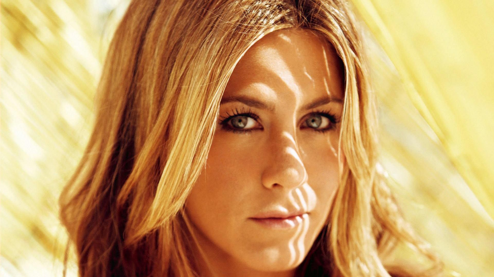
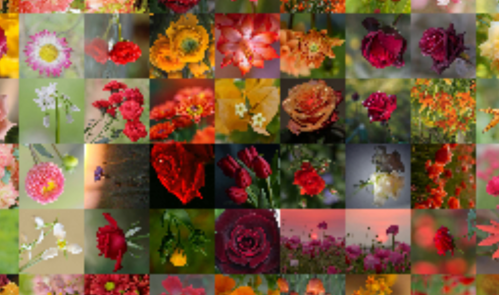

# muralia

### Jorge Lambraño Arroyo

El siguiente paquete es capaz de generar un mosaico de imágenes pequeñas una imagen principal y un sets de imágenes pequeñas.

Imagen de entrada: 

Imagen de salida: 

Imagen de salida ampliada: 

### Recomendaciones:

* Se pueden elegir si las imágenes serán rotadas e invertidas, modificando la lista listpost

* Es recomendable agregar más imágenes de las que estará compuesta el mosaico

* Se puede elegir el lugar de la imagen donde ocurren la mayoría de las correlaciones.

